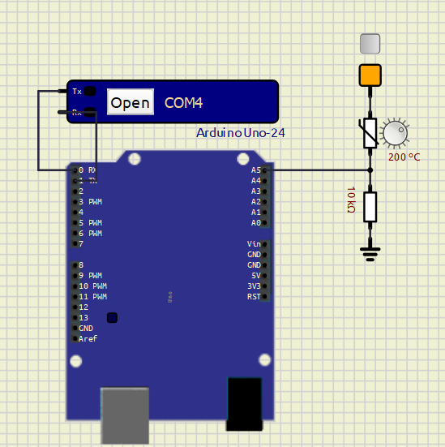

# Instrumentação Industrial II
## Aula Prática 01: Termistores NTC

Este repositório apresenta a base teórica e a implementação prática para medição de temperatura com **termistores NTC**, usando **Arduino Uno** e **ESP32**.

O material foi reorganizado para manter uma leitura mais clara e uma identidade visual única, com foco em:

- funcionamento do termistor NTC;
- montagem em divisor resistivo;
- modelos matemáticos **Beta** e **Steinhart-Hart**;
- relação entre a `fig01.png` e as equações implementadas no código;
- execução do projeto em microcontroladores.

---

## Índice

1. [Introdução](#1-introdução)
2. [Tipos de termistores](#2-tipos-de-termistores)
3. [Comportamento do NTC](#3-comportamento-do-ntc)
4. [Modelos matemáticos](#4-modelos-matemáticos)
5. [Montagem do circuito](#5-montagem-do-circuito)
6. [Relação entre a montagem e o código](#6-relação-entre-a-montagem-e-o-código)
7. [Arquivos do projeto](#7-arquivos-do-projeto)
8. [Como executar](#8-como-executar)
9. [Ferramenta de apoio online](#9-ferramenta-de-apoio-online)
10. [Sugestão de atividade experimental](#10-sugestão-de-atividade-experimental)
11. [Conclusão](#11-conclusão)
12. [Referências](#12-referências)

---

## 1. Introdução

O **termistor** é um resistor cuja resistência elétrica varia com a temperatura. Seu nome deriva da junção entre *temperature* e *resistor*.

Esse tipo de sensor é amplamente utilizado em:

- medição de temperatura;
- compensação térmica;
- proteção de circuitos;
- sistemas embarcados;
- automação e instrumentação.

Os termistores se destacam por apresentarem:

- baixo custo;
- alta sensibilidade;
- resposta rápida;
- integração simples com circuitos eletrônicos.

**Figura 1. Aparência de um termistor**


**Figura 2. Símbolo de um termistor**


---

## 2. Tipos de termistores

Os dois tipos mais comuns são:

- **NTC (Negative Temperature Coefficient):** a resistência diminui quando a temperatura aumenta;
- **PTC (Positive Temperature Coefficient):** a resistência aumenta quando a temperatura aumenta.

Neste projeto, o foco está no **termistor NTC**.

---

## 3. Comportamento do NTC

No termistor NTC, a resistência varia de forma **não linear** com a temperatura. Assim, quando a temperatura sobe, a resistência elétrica do sensor diminui, alterando a tensão no ponto de medição do circuito.

De forma qualitativa:

- a temperatura varia;
- a resistência do NTC muda;
- a tensão no divisor resistivo muda;
- o ADC converte essa tensão em valor digital;
- o software converte esse valor em temperatura.

Uma forma simplificada de representar a sensibilidade seria:

$$
\Delta R = k \cdot \Delta T
$$

Entretanto, essa relação serve apenas como aproximação intuitiva. Para o NTC, o comportamento real é melhor representado pelos modelos matemáticos da próxima seção.

---

## 4. Modelos matemáticos

### 4.1 Equação de Steinhart-Hart

Para maior precisão em uma faixa mais ampla de temperatura, usa-se a equação de **Steinhart-Hart**:

$$
\frac{1}{T} = a + b\ln(R) + c\left(\ln(R)\right)^3
$$

Onde:

- `T` é a temperatura absoluta em Kelvin;
- `R` é a resistência do termistor em ohms;
- `a`, `b` e `c` são coeficientes característicos do sensor.

Isolando `T`:

$$
T = \frac{1}{a + b\ln(R) + c\left(\ln(R)\right)^3}
$$

E a conversão para Celsius é dada por:

$$
T_{^\circ C} = T_K - 273{,}15
$$

### 4.2 Modelo Beta

Uma forma mais simples de modelar o NTC é usar o **modelo Beta**:

$$
\frac{1}{T} = \frac{1}{T_0} + \frac{1}{B}\ln\left(\frac{R}{R_0}\right)
$$

Onde:

- `T_0` é a temperatura nominal de referência em Kelvin;
- `R_0` é a resistência nominal do NTC em `T_0`;
- `B` é o coeficiente Beta do sensor;
- `R` é a resistência calculada do termistor.

Isolando `T`:

$$
T = \frac{1}{\frac{1}{T_0} + \frac{1}{B}\ln\left(\frac{R}{R_0}\right)}
$$

E novamente:

$$
T_{^\circ C} = T_K - 273{,}15
$$

### 4.3 Comparação entre os modelos

- **Modelo Beta:** mais simples e direto, adequado para implementação rápida.
- **Steinhart-Hart:** mais preciso, especialmente em faixas maiores de temperatura.

Por isso, o projeto calcula a temperatura pelos **dois métodos**.

---

## 5. Montagem do circuito

O circuito usado no projeto possui a topologia:

```text
Vcc --- NTC --- ADC --- resistor de série --- GND
```

Ou seja, o NTC e o resistor fixo formam um **divisor resistivo**, e o nó central é ligado à entrada analógica do microcontrolador.

**Figura 3. Esquema do divisor resistivo com NTC**



Se chamarmos a resistência do termistor de `R_{NTC}` e a resistência fixa de `R_{serie}`, então a tensão lida pelo ADC depende diretamente da razão entre esses dois resistores.

---

## 6. Relação entre a montagem e o código

O principal arquivo de referência do projeto é [`src/leituraNTC_unificado.cpp`](src/leituraNTC_unificado.cpp), que implementa a leitura tanto para **ESP32** quanto para **Arduino Uno**.

### 6.1 Resolução do ADC

No projeto, o valor máximo do conversor A/D depende da placa:

- **ESP32:** `4095` para ADC de 12 bits;
- **Arduino Uno:** `1023` para ADC de 10 bits.

No código isso aparece como:

```cpp
#if defined(ARDUINO_ARCH_ESP32)
  #define ADC_RESOLUTION 4095
#elif defined(ARDUINO_ARCH_AVR)
  #define ADC_RESOLUTION 1023
#endif
```

### 6.2 Equação do divisor resistivo

Na montagem da **Figura 3**, o NTC está na parte superior e o resistor fixo está na parte inferior. Chamando:

- `V_{cc}` de tensão de alimentação;
- `V_{adc}` de tensão no nó lido pelo ADC;
- `R_{NTC}` de resistência do termistor;
- `R_{serie}` de resistência fixa;

a equação do divisor resistivo é:

$$
V_{adc} = V_{cc}\cdot\frac{R_{serie}}{R_{NTC}+R_{serie}}
$$

Dividindo ambos os lados por `V_{cc}`:

$$
\frac{V_{adc}}{V_{cc}} = \frac{R_{serie}}{R_{NTC}+R_{serie}}
$$

Como o ADC converte a tensão em um número digital:

$$
\frac{V_{adc}}{V_{cc}} = \frac{ADC}{ADC_{max}}
$$

então:

$$
\frac{ADC}{ADC_{max}} = \frac{R_{serie}}{R_{NTC}+R_{serie}}
$$

Agora isolando `R_{NTC}`:

$$
R_{NTC}+R_{serie} = \frac{R_{serie}}{\left(\frac{ADC}{ADC_{max}}\right)}
$$

$$
R_{NTC} = \frac{R_{serie}}{\left(\frac{ADC}{ADC_{max}}\right)} - R_{serie}
$$

Essa é exatamente a expressão usada no programa:

```cpp
resistance = (serialResistance / ((float)analogValue)) * ADC_RESOLUTION - serialResistance;
```

### 6.3 Aplicação do modelo Beta no código

Depois que o programa calcula `R_{NTC}`, ele aplica a equação do modelo Beta:

$$
\frac{1}{T} = \frac{1}{T_0} + \frac{1}{B}\ln\left(\frac{R_{NTC}}{R_0}\right)
$$

No código:

- `TEMPERATURENOMINAL` representa a temperatura nominal em graus Celsius;
- `TEMPERATURENOMINAL + 273.15` converte essa referência para Kelvin;
- `bCoefficient` representa o coeficiente `B`;
- `nominalResistance` representa `R_0`;
- `resistance` representa `R_{NTC}`.

Substituindo os nomes matemáticos pelos nomes usados no programa:

$$
\frac{1}{T} =
\frac{1}{TEMPERATURENOMINAL + 273{,}15}
+
\frac{1}{bCoefficient}\ln\left(\frac{resistance}{nominalResistance}\right)
$$

Isolando `T`:

$$
T =
\frac{1}{
\frac{1}{TEMPERATURENOMINAL + 273{,}15}
+
\frac{1}{bCoefficient}\ln\left(\frac{resistance}{nominalResistance}\right)
}
$$

Chega-se exatamente à linha implementada no código:

```cpp
temp = 1.0 / ((1.0 / (TEMPERATURENOMINAL + 273.15)) +
              (1.0 / bCoefficient) * log(resistance / nominalResistance));
```

Como o resultado ainda está em Kelvin, a conversão final para Celsius é:

$$
T_{^\circ C} = T_K - 273{,}15
$$

o que no código aparece como:

```cpp
return (temp - 273.15);
```

### 6.4 Aplicação de Steinhart-Hart no código

O segundo método implementado usa a equação:

$$
\frac{1}{T} = a + b\ln(R_{NTC}) + c\left(\ln(R_{NTC})\right)^3
$$

Isolando `T`:

$$
T = \frac{1}{a + b\ln(R_{NTC}) + c\left(\ln(R_{NTC})\right)^3}
$$

No programa, isso aparece como:

```cpp
resistance = log(resistance);
temp = 1.0 / (a + b * resistance + c * resistance * resistance * resistance);
return (temp - 273.15);
```

Mais uma vez, o resultado intermediário é obtido em Kelvin e depois convertido para graus Celsius.

### 6.5 Filtragem e estabilidade da leitura

O código unificado também aplica duas técnicas para tornar a leitura mais estável:

- múltiplas amostras do ADC com descarte dos valores extremos;
- filtro **IIR** para suavização da temperatura calculada.

Isso ajuda a reduzir ruído e oscilações instantâneas nas leituras.

### 6.6 Execução periódica

No arquivo unificado, a função `tarefaNTC()` é executada periodicamente com auxílio da biblioteca `jtask`, permitindo atualização cíclica das medições.

---

## 7. Arquivos do projeto

Os principais arquivos deste repositório são:

- [`src/leituraNTC_unificado.cpp`](src/leituraNTC_unificado.cpp): versão unificada para ESP32 e Arduino Uno;
- [`src/leituraNTC_esp.cpp`](src/leituraNTC_esp.cpp): implementação específica para ESP32;
- [`src/leituraNTC_uno.cpp`](src/leituraNTC_uno.cpp): implementação específica para Arduino Uno;
- [`platformio.ini`](platformio.ini): configuração do ambiente PlatformIO;
- [`assets/`](assets): imagens e materiais de apoio.

---

## 8. Como executar

O projeto já possui configuração em [`platformio.ini`](platformio.ini).

No estado atual, o ambiente ativo está configurado para **ESP32**:

```ini
[env:esp32]
platform = espressif32
framework = arduino
board = esp32dev
build_src_filter = +<leituraNTC_esp.cpp>
```

Passos gerais:

1. Monte o divisor resistivo conforme a `fig01.png`.
2. Conecte o nó central à entrada analógica da placa.
3. Abra o projeto no PlatformIO.
4. Compile e grave o firmware.
5. Acompanhe os valores pela serial ou pela interface usada no código.

Observações importantes:

- o valor do resistor de série deve coincidir com o valor adotado no código;
- os coeficientes do NTC devem corresponder ao sensor real utilizado;
- no ESP32, a configuração do ADC influencia diretamente a qualidade da medição.

---

## 9. Ferramenta de apoio online

Como apoio à análise experimental deste projeto, também pode ser utilizada a ferramenta web:

<https://lasec-ufu.github.io/TempSensorCalibrator/>

Essa aplicação permite organizar pontos experimentais e comparar modelos matemáticos de sensores de temperatura diretamente no navegador.

No contexto deste projeto com NTC, ela pode ser usada para:

- registrar pares de temperatura e resistência;
- comparar o comportamento experimental com os modelos teóricos;
- apoiar a análise dos coeficientes do sensor;
- facilitar a montagem de tabelas e resultados para relatório.

Como a ferramenta roda no navegador, ela serve como complemento didático ao experimento sem depender da versão em Python que foi removida desta documentação.

---

## 10. Sugestão de atividade experimental

Uma prática simples de laboratório é comparar a leitura calculada pelo sistema com uma temperatura de referência conhecida.

### Roteiro sugerido

1. Escolha pelo menos cinco pontos de temperatura.
2. Uma sugestão é usar:
   - `0 °C`
   - `25 °C`
   - `40 °C`
   - `60 °C`
   - `80 °C`
3. Aguarde a estabilização térmica do sensor em cada ponto.
4. Registre:
   - temperatura de referência;
   - valor bruto do ADC;
   - temperatura calculada pelo modelo Beta;
   - temperatura calculada por Steinhart-Hart.
5. Repita cada medição mais de uma vez.
6. Compare os resultados e observe o erro e a diferença entre os modelos.

### Exemplo de tabela

| Temperatura de referência | ADC | Temp. Beta | Temp. Steinhart-Hart |
|---|---:|---:|---:|
| 0 °C | ADC1 | T1 | T1' |
| 25 °C | ADC2 | T2 | T2' |
| 40 °C | ADC3 | T3 | T3' |

Essa atividade ajuda a conectar teoria, montagem eletrônica e software em uma mesma prática.

---

## 11. Conclusão

O projeto mostra, de forma aplicada, como uma grandeza física pode ser convertida em informação digital útil:

- a temperatura altera a resistência do NTC;
- a resistência altera a tensão do divisor resistivo;
- o ADC mede essa tensão;
- o programa reconstrói a resistência do sensor;
- os modelos matemáticos convertem a resistência em temperatura.

Com isso, o repositório serve tanto como material de estudo quanto como apoio para aula prática de instrumentação.

---

## 12. Referências

- Apostila de Instrumentação Industrial II - UFU
- Steinhart, J. S.; Hart, S. R. *Calibration curves for thermistors.* Deep-Sea Research, 15(4), 497-503, 1968.
- [Teoria dos termistores - Wikipedia](https://pt.wikipedia.org/wiki/Termistor)
- [TempSensorCalibrator - LASEC/UFU](https://lasec-ufu.github.io/TempSensorCalibrator/)
